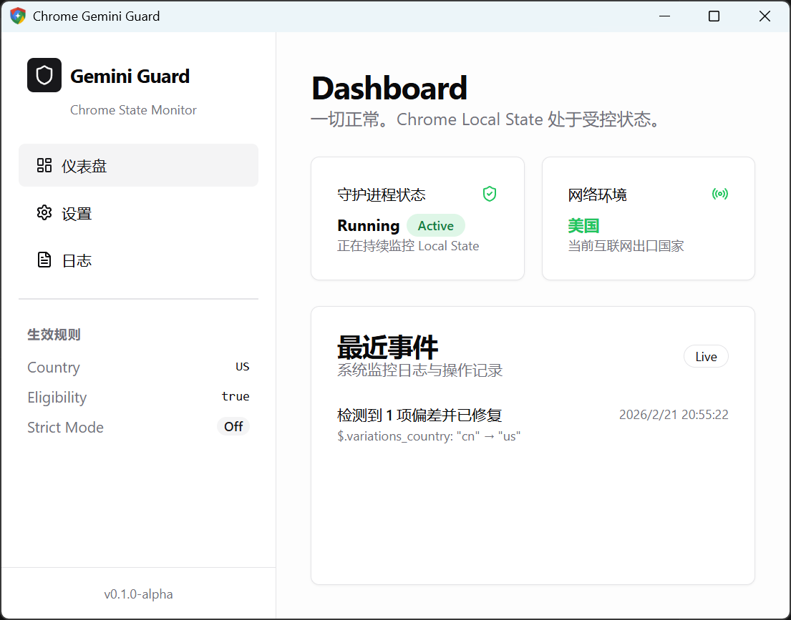

# 🛡️ Chrome Gemini Guard

[](https://github.com/luxi78/chrome-gemini-guard/releases)
[](https://github.com/luxi78/chrome-gemini-guard/releases)
[](#)
[](https://opensource.org/licenses/MIT)

[English](README.md) | **中文**

**Chrome Gemini Guard** 是一个轻量级的桌面守护程序。它可以帮助你在非美区网络环境下，**永久、稳定地开启并使用 Google Chrome 浏览器内置的 Gemini AI 助手 (glic)**。

---

## 💡 为什么需要这个项目？ (痛点与根因)

Google 在 Chrome 中集成了强大的 Gemini AI（地址栏右上角图标），但对网络环境进行了严格的区域限制。

网上的常规教程（如使用 Python 脚本或直接修改配置文件）通常只是一次性生效的。**由于 Chrome 会在后台同步或重启时，悄悄将配置文件（`Local State`）中的国家代码回写为你的真实所在地，导致 Gemini 图标频繁消失**，用户不得不反复手动修改，体验极差。

**本项目的解决方案：**
本项目作为一个常驻系统托盘的守护进程，利用文件系统监控（Watcher）实时"盯死" Chrome 的 `Local State` 文件。一旦发现 Chrome 试图关闭 Gemini 或重置地区，它将在毫秒级内静默拦截并修复，**彻底免除反复修改的烦恼**。

## ✨ 核心特性

- 🛡️ **实时守护**：基于系统底层的文件监控，Chrome 刚回写配置，瞬间自动改回。
- 🚀 **开箱即用**：提供可视化控制面板，一键启动守护，无需配置复杂的命令行环境。
- 👻 **无感运行**：开机自启（可选），常驻系统托盘，极低资源占用（基于 Rust + Tauri 开发）。
- 🌍 **全平台支持**：支持 Windows 和 macOS。
- 🧠 **精准修复**：精准定位并锁定 `variations_country`、`variations_permanent_consistency_country` (修改为 `us`) 以及全局 `is_glic_eligible` (修改为 `true`)。

## 📥 下载与使用

### 1. 下载与运行 (免安装绿色版)
前往 [Releases 页面](https://github.com/luxi78/chrome-gemini-guard/releases) 下载最新版本：
- **Windows**: 下载 `chrome-gemini-guard.exe` (纯绿色单文件版，下载即用，无需安装)
- **macOS**: 下载 `.dmg` 或独立运行程序

### 2. 快速使用
1. 关闭正在运行的所有 Chrome 浏览器。
2. 打开 **Chrome Gemini Guard**。
3. 在可视化界面中确保"守护模式"处于开启状态。
4. 重新打开 Chrome，右上角的 Gemini 图标即可永久常驻。





---

## 🛠️ 开发者指南

本项目前端基于 **React + TypeScript + TailwindCSS**，后端基于 **Rust + Tauri 2.x**。欢迎提交 PR 和 Issue！

### 1. 环境准备
- [Bun](https://bun.sh/)（前端包管理和测试）
- [Rust + Cargo](https://rustup.rs/)（Rust 编译与测试）
- Windows 需安装 Visual Studio Build Tools 2022 (包含 C++ 及 MSVC 工具链)

### 2. 本地运行
```bash
# 1. 安装前端依赖
bun install

# 2. 启动完整桌面应用调试
bun run tauri:dev
```

### 3. 编译打包
```bash
bun run tauri:build
```
> 注：为了实现 Windows 绿色版"零依赖"（脱离 vcruntime140.dll），本项目默认开启了静态链接 C 运行时。具体详见 `src-tauri/.cargo/config.toml`。

### 4. 测试
- **前端测试 (Vitest)**: `bun run test`
- **后端测试 (Cargo)**: `cd src-tauri && cargo test`

## 🤝 致谢

本项目的灵感和核心修改逻辑参考了开源社区的探索成果，特别感谢：
- [lcandy2/enable-chrome-ai](https://github.com/lcandy2/enable-chrome-ai) 提供的 Python 解析与修改思路。

## 📄 许可证

本项目基于 [MIT License](LICENSE) 开源。请勿将本软件用于任何非法或破坏性用途，由此产生的一切后果由使用者自行承担。
